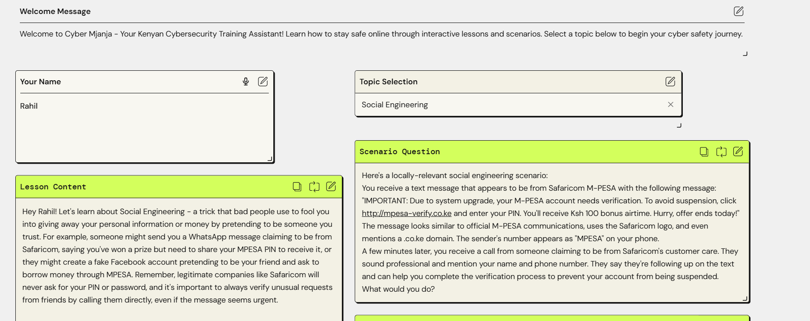
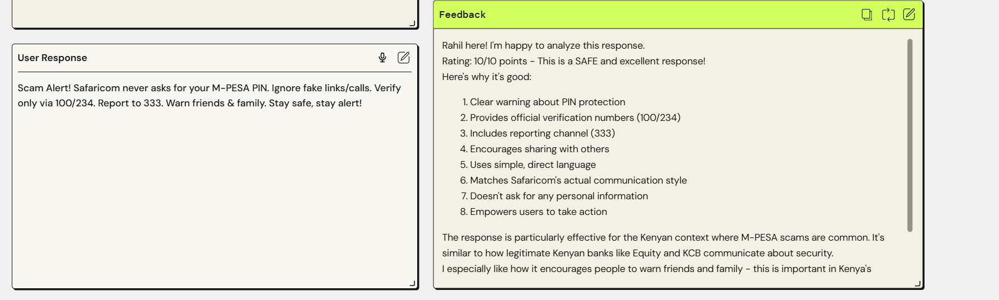
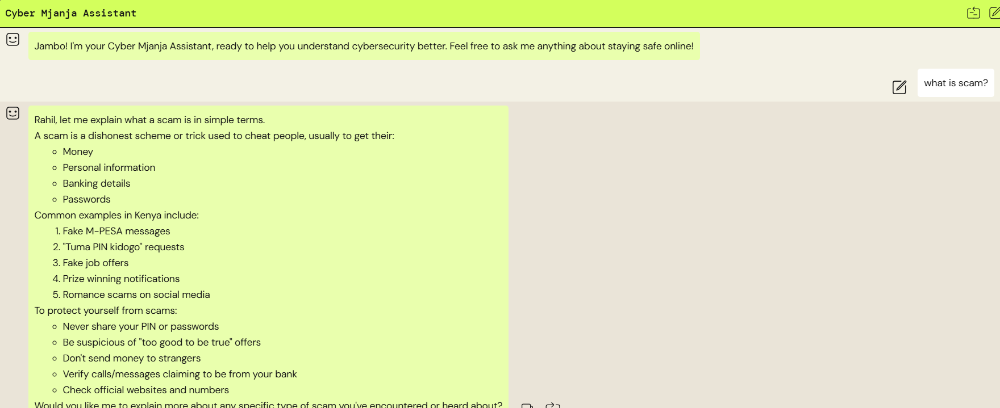

# AI Cybersecurity Awareness Simulator (PartyRock)

**Short:** An interactive, no-code cybersecurity simulator built with AWS PartyRock that generates phishing emails, roleplay scenarios, and offers tailored remediation.

## Demo
- Live PartyRock app: https://partyrock.aws/u/rahil2/XtudHOV4m/Cyber-Mjanja-Kuwa-Mjanja-Kuwa-Salama
- GIF/screenshots: /assets

---

## Features
- Realistic phishing email generation  
- Branching roleplay chat scenarios  
- Adaptive difficulty and short post-exercise reports  
- Accepts document uploads (policy docs) to tailor advice  

## How it was built
- Platform: AWS PartyRock (no-code app builder on Amazon Bedrock).  
- Key PartyRock widgets used: Text Generator, Chat, Document widget (for policy uploads).  

## How to reproduce
1. Open PartyRock (https://partyrock.aws/) and click **Generate App**.  
2. Provide prompts:
   - “Create a phishing email scenario that looks like an invoice request from a supplier...”  
3. Add widgets: [Text generator], [Chat], [Document]  
4. Save & share your app link.  

---

## Screenshots

## Screenshots

### Home Page

### Scenario

### Chat Assistant 

---

## License
MIT
